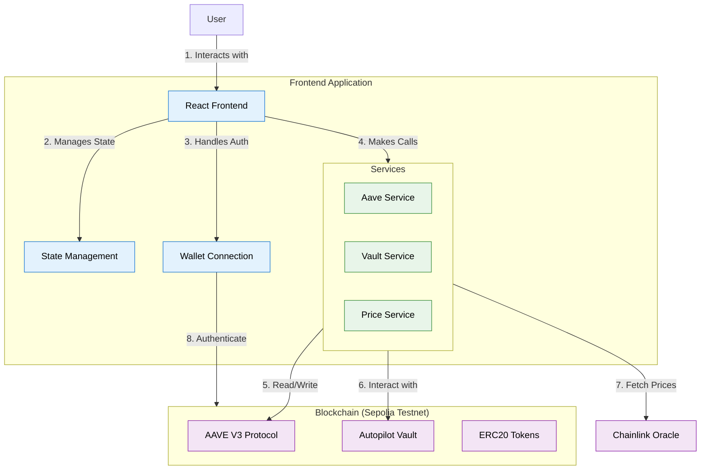

# 🏗️ AAVE Autopilot UI Architecture

## System Overview

### Architecture Diagram

*Figure 1: Frontend architecture and data flow*

### Component Structure

## Key Components

### 1. Frontend Application
- Built with React and TypeScript
- Uses Vite for fast development and building
- Implements responsive design with Tailwind CSS
- Features dark/light mode theming

### 2. State Management
- Uses React Context API for global state
- Manages wallet connection state
- Tracks transaction states and user balances

### 3. Wallet Integration
- Supports multiple wallet providers (MetaMask, WalletConnect, etc.)
- Handles chain switching and network validation
- Manages user authentication and session

### 4. Service Layer
- **AaveService**: Handles interactions with AAVE V3 protocol
- **VaultService**: Manages vault operations (deposit/withdraw)
- **PriceService**: Fetches real-time price feeds

## Data Flow

1. User connects their wallet
2. Application fetches user balances and positions
3. User initiates transactions (deposit/withdraw)
4. Transactions are signed and sent to the blockchain
5. UI updates to reflect the new state

## Security Considerations

- All transactions require explicit user approval
- Contract addresses are validated against the current network
- Sensitive operations are confirmed with user prompts
- Environment variables are used for configuration
